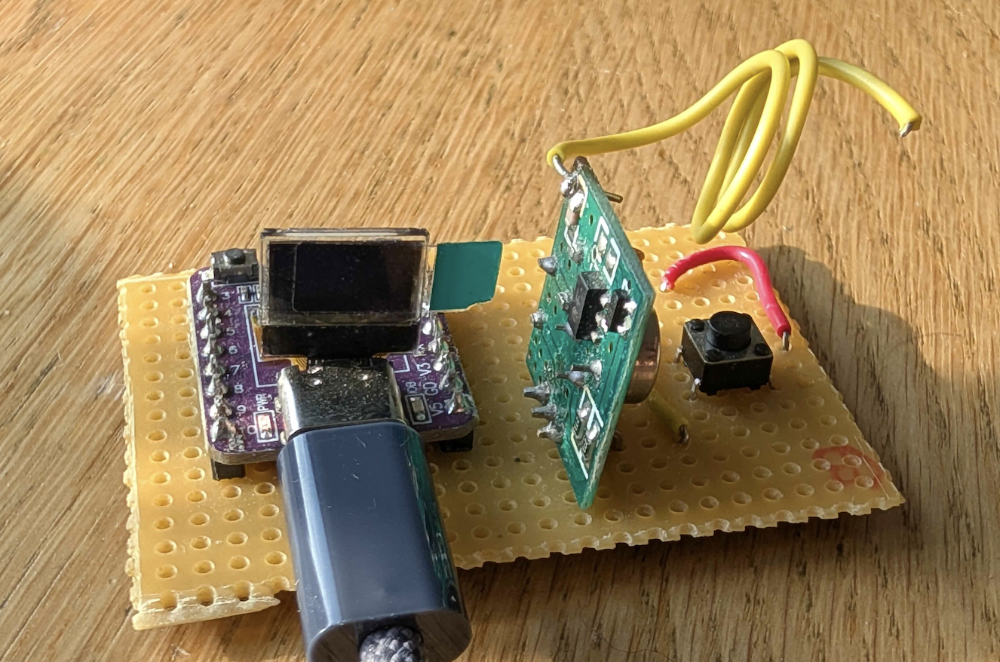
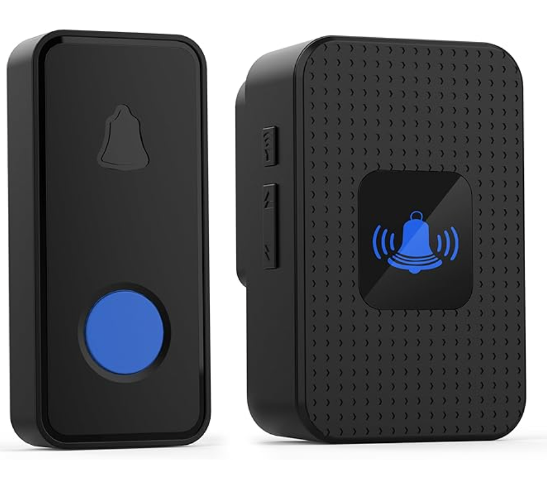
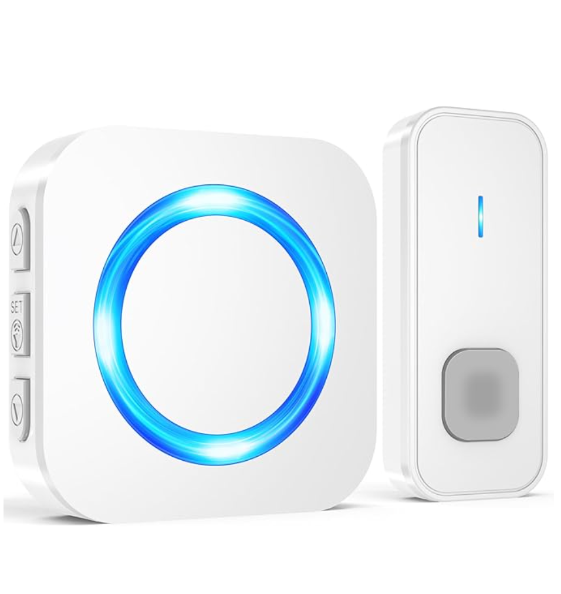
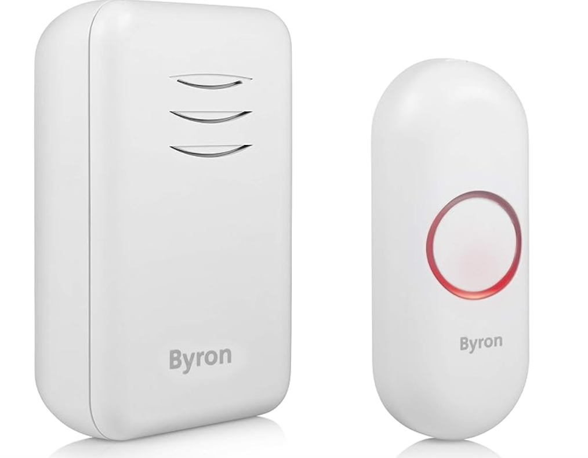
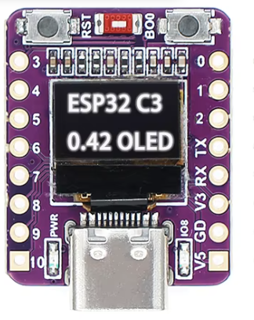
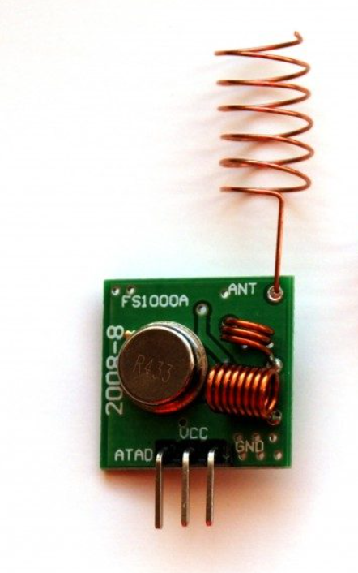
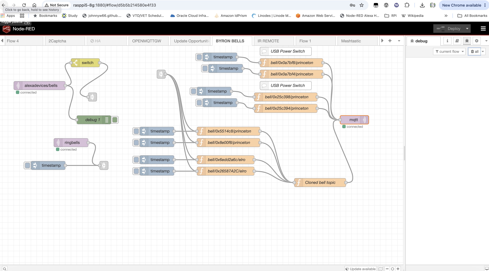

## ESP32-C3 MQTT to RF (433MHz) Gateway







A MicroPython-powered gateway designed for the ESP32-C3 that bridges MQTT commands to 433MHz radio frequency (RF) signals. It supports protocols commonly used for wireless doorbells and smart switches (such as Elro and Princeton PT2262/EV1527), features local status feedback via an optional SSD1306 OLED display, and includes a physical test button. 

Only **3 components** are needed. ESP32-C3, FS1000A (433 Mhz), and a push button. Total cost less than $5 dollars!

**NOTE: Make sure you buy the correct version of the FS1000A. They come in several frequency flavours. Most of Bell/USB Switch Systems in the UK/EU are 433 Mhz - so I bought the 433Mhz FS1000A.**

## Features

* MQTT Subscription: Listens to wildcard topics (bell/#) to dynamically trigger or register RF bell commands.

* Multi-Protocol Support: Handles both 32-bit Elro and 24-bit Princeton RF transmission formats using the ESP32's built-in RMT (Remote Control) peripheral for precise timing.

* OLED Display Support: Visualizes system states, connection feedback, and triggered bell Hex IDs in real-time.

* Local Test Button: Includes an onboard button input to manually cycle and test configured bells locally.

## Wiring Guide

Connect your hardware components to the ESP32-C3 development board according to the pin mapping below:






| Component | ESP32 Pin  | Description |
| :--- | :---: | ---: |
| FS1000A ATAD| GPIO 2	| Data pin for RF transmission (configured via FS1000A_PIN) |
| FS1000A VCC| +5v	'V5'| It is OK to drive this at 5v |
| FS1000A GND| GND ESP32 'GD'| Ground |
| Test Button | GPIO 0	| Pull-up enabled on GPIO 0 see mqtt.py|
| Test Button | GND ESP32 'GD'	| Ground  |

The Onboard LED is used as heartbeat/status indicator.

Make sure you have wired your **Test** button correctly - use a multi-meter to check that you are not using a common line! Easy to do! :)

Add a simple antenna on your FS1000A if you don't have one attached. Ideally for the 433Mhz band, this should be a straight bit of wire - approx 17.3cm in length.
I squashed my antenna so that the gateway could fit inside a case - causing some loss on its transmission power.


## Configuration & Setup

Create a file named **secret.py** on your ESP32-C3 running MicroPython containing your network credentials and MQTT broker settings:


To configure the **mqtt.py** script for your specific wireless devices, you will need to update the payload values with the exact raw protocol timings and data codes captured by your Flipper Zero. Open the script and locate the transmission definition arrays, then substitute the default values with your captured parameters—typically including the protocol ID, pulse length, and the unique binary or hexadecimal code corresponding to your specific doorbell or switch.

(Note: Ensure you match the exact sub-GHz modulation (usually ASK/OOK at 433.92 MHz) and bit length reported by the Flipper's raw analysis tool to guarantee reliable triggering over the air.)
Python


```
WIFI_SSID = 'YOUR_WIFI_SSID'
WIFI_PASS = 'YOUR_WIFI_PASSWORD'

MQTT_BROKER = 'your-mqtt-broker.com'
MQTT_PORT = 1883
MQTT_USER = 'YOUR_MQTT_USER'
MQTT_PASS = 'YOUR_MQTT_PASSWORD'
```

Upload the main scripts **mqtt.py** alongside your **secret.py** and the required MicroPython SSD1306 driver library (**sdd1306.py**) if required. 

In your **main.py** (the source which is automatically run on your ESP32 booting up) - simply use the following source

```
import mqtt
```

Alternatively, you could just copy the contents of **mqtt.py** into main.py

## Node-RED Integration
You can easily control the gateway from Node-RED by publishing payloads to the topic structure expected by the firmware: bell/{HEXID}/{type} (where {type} is either elro or princeton).

## Example Node-RED Flow



Import the flow below into your Node-RED workspace to provide a dashboard button or manual inject node that triggers a remote bell command:


```
[
    {
        "id": "d5b5b214580e4f33",
        "type": "tab",
        "label": "BYRON BELLS",
        "disabled": false,
        "info": "",
        "env": []
    },
    {
        "id": "84236a7d824cfa60",
        "type": "mqtt out",
        "z": "d5b5b214580e4f33",
        "name": "",
        "topic": "",
        "qos": "1",
        "retain": "false",
        "respTopic": "",
        "contentType": "",
        "userProps": "",
        "correl": "",
        "expiry": "",
        "broker": "0822aac84669be40",
        "x": 1250,
        "y": 260,
        "wires": []
    },
    {
        "id": "27238f62f87f4375",
        "type": "link in",
        "z": "d5b5b214580e4f33",
        "name": "RING BYRON BELLS",
        "links": [
            "47d6d8c8e6e3131d",
            "59e1f2455248f9db"
        ],
        "x": 575,
        "y": 100,
        "wires": [
            [
                "831f1a58410a74a8",
                "a8e6082589787f8e",
                "89ca56d7fb3c1305",
                "1284127fd21bc87c"
            ]
        ]
    },
    {
        "id": "03f7c00e8237ca10",
        "type": "mqtt in",
        "z": "d5b5b214580e4f33",
        "name": "",
        "topic": "ringbells",
        "qos": "2",
        "datatype": "auto-detect",
        "broker": "0822aac84669be40",
        "nl": false,
        "rap": true,
        "rh": 0,
        "inputs": 0,
        "x": 260,
        "y": 340,
        "wires": [
            [
                "47d6d8c8e6e3131d"
            ]
        ]
    },
    {
        "id": "47d6d8c8e6e3131d",
        "type": "link out",
        "z": "d5b5b214580e4f33",
        "name": "link out 71",
        "mode": "link",
        "links": [
            "27238f62f87f4375"
        ],
        "x": 375,
        "y": 420,
        "wires": []
    },
    {
        "id": "a0c64e020661b605",
        "type": "inject",
        "z": "d5b5b214580e4f33",
        "name": "",
        "props": [
            {
                "p": "payload"
            },
            {
                "p": "topic",
                "vt": "str"
            }
        ],
        "repeat": "",
        "crontab": "",
        "once": false,
        "onceDelay": 0.1,
        "topic": "",
        "payload": "",
        "payloadType": "date",
        "x": 180,
        "y": 420,
        "wires": [
            [
                "47d6d8c8e6e3131d"
            ]
        ]
    },
    {
        "id": "831f1a58410a74a8",
        "type": "function",
        "z": "d5b5b214580e4f33",
        "name": "bell/0x8e00f8/princeton",
        "func": "msg.topic ='bell/0x8e00f8/princeton';\n\nreturn msg;\n",
        "outputs": 1,
        "timeout": 0,
        "noerr": 0,
        "initialize": "",
        "finalize": "",
        "libs": [],
        "x": 810,
        "y": 340,
        "wires": [
            [
                "0c71cbeb2c306458"
            ]
        ]
    },
    {
        "id": "d25460fba9b54541",
        "type": "inject",
        "z": "d5b5b214580e4f33",
        "name": "",
        "props": [
            {
                "p": "payload"
            },
            {
                "p": "topic",
                "vt": "str"
            }
        ],
        "repeat": "",
        "crontab": "",
        "once": false,
        "onceDelay": 0.1,
        "topic": "",
        "payload": "",
        "payloadType": "date",
        "x": 560,
        "y": 340,
        "wires": [
            [
                "831f1a58410a74a8"
            ]
        ]
    },
    {
        "id": "a8e6082589787f8e",
        "type": "function",
        "z": "d5b5b214580e4f33",
        "name": "bell/0x6edd2a6c/elro",
        "func": "msg.topic ='bell/0x6edd2a6c/elro';\nreturn msg; // return msg;\n\n",
        "outputs": 1,
        "timeout": 0,
        "noerr": 0,
        "initialize": "",
        "finalize": "",
        "libs": [],
        "x": 800,
        "y": 400,
        "wires": [
            [
                "0c71cbeb2c306458"
            ]
        ]
    },
    {
        "id": "1c5ab6336aaef1f0",
        "type": "inject",
        "z": "d5b5b214580e4f33",
        "name": "",
        "props": [
            {
                "p": "payload"
            },
            {
                "p": "topic",
                "vt": "str"
            }
        ],
        "repeat": "",
        "crontab": "",
        "once": false,
        "onceDelay": 0.1,
        "topic": "",
        "payload": "",
        "payloadType": "date",
        "x": 560,
        "y": 400,
        "wires": [
            [
                "a8e6082589787f8e"
            ]
        ]
    },
    {
        "id": "89ca56d7fb3c1305",
        "type": "function",
        "z": "d5b5b214580e4f33",
        "name": "bell/0x26587A2C/elro",
        "func": "msg.topic ='bell/0x26587A2C/elro';\nreturn msg; // return msg;\n",
        "outputs": 1,
        "timeout": 0,
        "noerr": 0,
        "initialize": "",
        "finalize": "",
        "libs": [],
        "x": 800,
        "y": 440,
        "wires": [
            [
                "0c71cbeb2c306458"
            ]
        ]
    },
    {
        "id": "121a2e750b9cd110",
        "type": "inject",
        "z": "d5b5b214580e4f33",
        "name": "",
        "props": [
            {
                "p": "payload"
            },
            {
                "p": "topic",
                "vt": "str"
            }
        ],
        "repeat": "",
        "crontab": "",
        "once": false,
        "onceDelay": 0.1,
        "topic": "",
        "payload": "",
        "payloadType": "date",
        "x": 560,
        "y": 440,
        "wires": [
            [
                "89ca56d7fb3c1305"
            ]
        ]
    },
    {
        "id": "1284127fd21bc87c",
        "type": "function",
        "z": "d5b5b214580e4f33",
        "name": "bell/0x5514c8/princeton",
        "func": "\nmsg.topic ='bell/0x5514c8/princeton';\n\nreturn msg;\n",
        "outputs": 1,
        "timeout": 0,
        "noerr": 0,
        "initialize": "",
        "finalize": "",
        "libs": [],
        "x": 810,
        "y": 300,
        "wires": [
            [
                "0c71cbeb2c306458"
            ]
        ]
    },
    {
        "id": "97ea7ebee19ef256",
        "type": "inject",
        "z": "d5b5b214580e4f33",
        "name": "",
        "props": [
            {
                "p": "payload"
            },
            {
                "p": "topic",
                "vt": "str"
            }
        ],
        "repeat": "",
        "crontab": "",
        "once": false,
        "onceDelay": 0.1,
        "topic": "",
        "payload": "",
        "payloadType": "date",
        "x": 560,
        "y": 300,
        "wires": [
            [
                "1284127fd21bc87c"
            ]
        ]
    },
    {
        "id": "3e7d5f62d32c24ef",
        "type": "function",
        "z": "d5b5b214580e4f33",
        "name": "bell/0x0a7bf8/princeton",
        "func": "msg.topic ='bell/0x0a7bf8/princeton';\nmsg.payload='';\n\nreturn msg;\n",
        "outputs": 1,
        "timeout": 0,
        "noerr": 0,
        "initialize": "",
        "finalize": "",
        "libs": [],
        "x": 1030,
        "y": 60,
        "wires": [
            [
                "84236a7d824cfa60"
            ]
        ]
    },
    {
        "id": "badad628e0e2ed1f",
        "type": "inject",
        "z": "d5b5b214580e4f33",
        "name": "",
        "props": [
            {
                "p": "payload"
            },
            {
                "p": "topic",
                "vt": "str"
            }
        ],
        "repeat": "",
        "crontab": "",
        "once": false,
        "onceDelay": 0.1,
        "topic": "",
        "payload": "",
        "payloadType": "date",
        "x": 780,
        "y": 40,
        "wires": [
            [
                "3e7d5f62d32c24ef"
            ]
        ]
    },
    {
        "id": "847a85e33ba4882f",
        "type": "function",
        "z": "d5b5b214580e4f33",
        "name": "bell/0x0a7bf4/princeton",
        "func": "msg.topic ='bell/0x0a7bf4/princeton';\nmsg.payload='';\n\n\nreturn msg;\n",
        "outputs": 1,
        "timeout": 0,
        "noerr": 0,
        "initialize": "",
        "finalize": "",
        "libs": [],
        "x": 1030,
        "y": 100,
        "wires": [
            [
                "84236a7d824cfa60"
            ]
        ]
    },
    {
        "id": "9d01026d179c1948",
        "type": "inject",
        "z": "d5b5b214580e4f33",
        "name": "",
        "props": [
            {
                "p": "payload"
            },
            {
                "p": "topic",
                "vt": "str"
            }
        ],
        "repeat": "",
        "crontab": "",
        "once": false,
        "onceDelay": 0.1,
        "topic": "",
        "payload": "",
        "payloadType": "date",
        "x": 800,
        "y": 80,
        "wires": [
            [
                "847a85e33ba4882f"
            ]
        ]
    },
    {
        "id": "3c034b9ffd585df5",
        "type": "function",
        "z": "d5b5b214580e4f33",
        "name": "bell/0x25c398/princeton",
        "func": "msg.topic ='bell/0x25c398/princeton';\nmsg.payload='';\n\nreturn msg;\n",
        "outputs": 1,
        "timeout": 0,
        "noerr": 0,
        "initialize": "",
        "finalize": "",
        "libs": [],
        "x": 1010,
        "y": 180,
        "wires": [
            [
                "84236a7d824cfa60"
            ]
        ]
    },
    {
        "id": "d58d2fb6435b4d8e",
        "type": "function",
        "z": "d5b5b214580e4f33",
        "name": "bell/0x25c394/princeton",
        "func": "msg.topic ='bell/0x25c394/princeton';\nmsg.payload='';\n\nreturn msg;\n",
        "outputs": 1,
        "timeout": 0,
        "noerr": 0,
        "initialize": "",
        "finalize": "",
        "libs": [],
        "x": 1010,
        "y": 220,
        "wires": [
            [
                "84236a7d824cfa60"
            ]
        ]
    },
    {
        "id": "a112a2a0e8a9ab30",
        "type": "inject",
        "z": "d5b5b214580e4f33",
        "name": "",
        "props": [
            {
                "p": "payload"
            },
            {
                "p": "topic",
                "vt": "str"
            }
        ],
        "repeat": "",
        "crontab": "",
        "once": false,
        "onceDelay": 0.1,
        "topic": "",
        "payload": "",
        "payloadType": "date",
        "x": 760,
        "y": 160,
        "wires": [
            [
                "3c034b9ffd585df5"
            ]
        ]
    },
    {
        "id": "b90f87913b16be03",
        "type": "inject",
        "z": "d5b5b214580e4f33",
        "name": "",
        "props": [
            {
                "p": "payload"
            },
            {
                "p": "topic",
                "vt": "str"
            }
        ],
        "repeat": "",
        "crontab": "",
        "once": false,
        "onceDelay": 0.1,
        "topic": "",
        "payload": "",
        "payloadType": "date",
        "x": 780,
        "y": 200,
        "wires": [
            [
                "d58d2fb6435b4d8e"
            ]
        ]
    },
    {
        "id": "e04a7cc3ed890488",
        "type": "comment",
        "z": "d5b5b214580e4f33",
        "name": "USB Power Switch ",
        "info": "",
        "x": 1010,
        "y": 140,
        "wires": []
    },
    {
        "id": "bb3920a70a1c886f",
        "type": "comment",
        "z": "d5b5b214580e4f33",
        "name": "USB Power Switch ",
        "info": "",
        "x": 1010,
        "y": 20,
        "wires": []
    },
    {
        "id": "affc0daac12a1312",
        "type": "mqtt in",
        "z": "d5b5b214580e4f33",
        "name": "",
        "topic": "alexadevices/bells",
        "qos": "2",
        "datatype": "json",
        "broker": "0822aac84669be40",
        "nl": false,
        "rap": true,
        "rh": 0,
        "inputs": 0,
        "x": 150,
        "y": 140,
        "wires": [
            [
                "0023c641f9d8ab48",
                "c3e8687a998265b4"
            ]
        ]
    },
    {
        "id": "59e1f2455248f9db",
        "type": "link out",
        "z": "d5b5b214580e4f33",
        "name": "link out 5",
        "mode": "link",
        "links": [
            "27238f62f87f4375"
        ],
        "x": 335,
        "y": 180,
        "wires": []
    },
    {
        "id": "0023c641f9d8ab48",
        "type": "debug",
        "z": "d5b5b214580e4f33",
        "name": "debug 1",
        "active": true,
        "tosidebar": true,
        "console": false,
        "tostatus": false,
        "complete": "true",
        "targetType": "full",
        "statusVal": "",
        "statusType": "auto",
        "x": 340,
        "y": 260,
        "wires": []
    },
    {
        "id": "c3e8687a998265b4",
        "type": "switch",
        "z": "d5b5b214580e4f33",
        "name": "",
        "property": "payload.value",
        "propertyType": "msg",
        "rules": [
            {
                "t": "true"
            }
        ],
        "checkall": "true",
        "repair": false,
        "outputs": 1,
        "x": 310,
        "y": 60,
        "wires": [
            [
                "59e1f2455248f9db"
            ]
        ]
    },
    {
        "id": "0c71cbeb2c306458",
        "type": "function",
        "z": "d5b5b214580e4f33",
        "name": "Cloned bell topic",
        "func": "//Assume topic set by something of the form\n// msg.topic ='bell/0x5514c8/princeton';\n\n\nconst clone_time  = 4000\n\nmsg.payload='';\n\n// send a copy after clone_time milliseconds\nsetTimeout(function () {\n    node.warn(`Cloned Bell ${msg.topic}`) ;\n    // clone the message so we don’t reuse the same object\n    node.send({ ...msg });\n}, clone_time);\nnode.warn(`Ring Bell ${msg.topic}`) ;\nreturn msg;\n",
        "outputs": 1,
        "timeout": 0,
        "noerr": 0,
        "initialize": "",
        "finalize": "",
        "libs": [],
        "x": 1130,
        "y": 480,
        "wires": [
            [
                "84236a7d824cfa60"
            ]
        ]
    },
    {
        "id": "0822aac84669be40",
        "type": "mqtt-broker",
        "name": "Linode",
        "broker": "132.145.21.76",
        "port": "1883",
        "clientid": "",
        "autoConnect": true,
        "usetls": false,
        "protocolVersion": "4",
        "keepalive": "60",
        "cleansession": true,
        "autoUnsubscribe": true,
        "birthTopic": "",
        "birthQos": "0",
        "birthRetain": "false",
        "birthPayload": "",
        "birthMsg": {},
        "closeTopic": "",
        "closeQos": "0",
        "closeRetain": "false",
        "closePayload": "",
        "closeMsg": {},
        "willTopic": "",
        "willQos": "0",
        "willRetain": "false",
        "willPayload": "",
        "willMsg": {},
        "userProps": "",
        "sessionExpiry": ""
    }
]

```

Javascript source for 'Cloned bell topic' node

```
//Assume topic set by something of the form
// msg.topic ='bell/0x5514c8/princeton';


const clone_time  = 4000

msg.payload='';

// send a copy after clone_time milliseconds
setTimeout(function () {
    node.warn(`Cloned Bell ${msg.topic}`) ;
    // clone the message so we don’t reuse the same object
    node.send({ ...msg });
}, clone_time);
node.warn(`Ring Bell ${msg.topic}`) ;
return msg;

```


